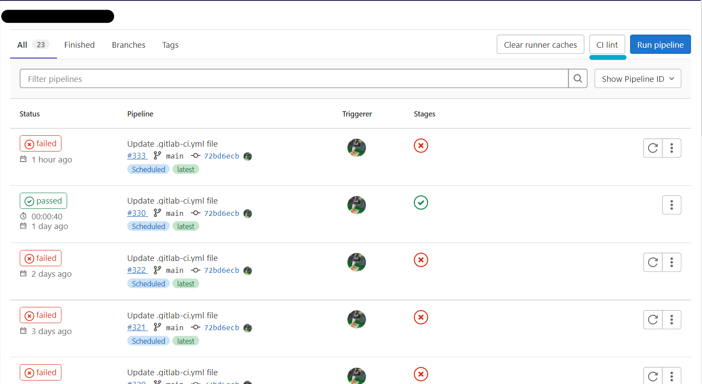
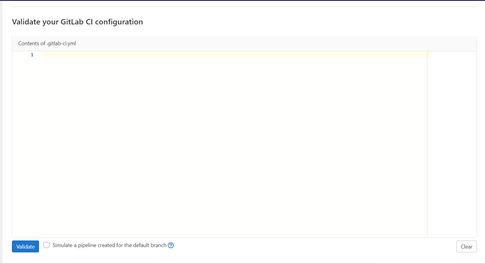
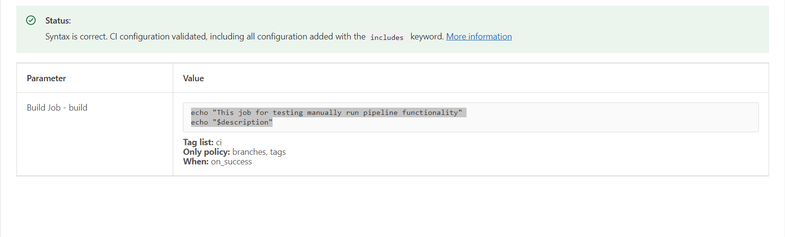
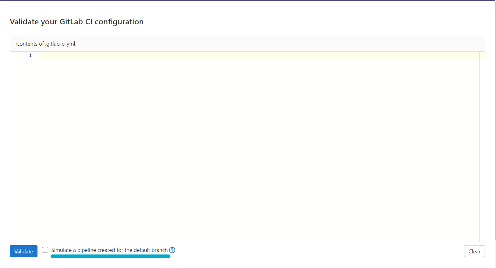

.gitlab-ci.yml
==============

Validates syntax
----------------

使用 Gitlab 提供的 CI Lint 工具去驗證自己寫的 configuration 是否有效，它可以確認 syntax 以及 logic 錯誤，也可以模擬 pipeline 執行狀況來找到更多的設定問題，如果是使用 pipeline editor 的話，內建會自動驗證設定檔內容，而如果是 VS Code，可以去安裝 `GitLab Workflow VS Code extension <https://docs.gitlab.com/ee/user/project/repository/vscode.html>`_

**Check CI/CD syntax**
**********************

1. 選擇要執行的 `Project`

2. sidebar 選擇 `CI/CD` -> `Pipelines`

3. 右上角點選 `CI lint`

.. rst-class:: image-source

Photo by `Neo Change Gitlab Account`

4. 把要測試的內容貼到 text box 裡面

.. rst-class:: image-source

Photo by `Neo Change Gitlab Account`

5. 點擊 `Validate`，點擊之後成功會長這樣

.. rst-class:: image-source

Photo by `Neo Change Gitlab Account`

**Simulate a pipeline**
***********************

基本上就是模擬 pipeline 在 default branch 上的執行情況，視同於 Git ``push`` 事件

1. 選擇要執行的 `Project`

2. sidebar 選擇 `CI/CD` -> `Pipelines`

3. 右上角點選 `CI lint`

.. rst-class:: image-source

Photo by `Neo Change Gitlab Account`

4. 把要測試的內容貼到 text box 裡面

.. rst-class:: image-source

Photo by `Neo Change Gitlab Account`

5. 把 Simulate pipeline creation for the default branch 打勾

.. rst-class:: image-source

Photo by `Neo Change Gitlab Account`

6. 點擊 `Validate`，點擊之後成功會長這樣

.. rst-class:: image-source

Photo by `Neo Change Gitlab Account`
