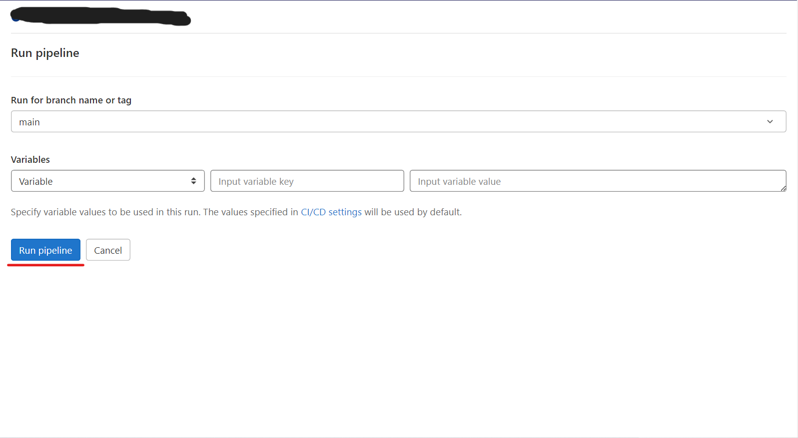

Pipelines
=========

Overview
--------
  .. |Overview| raw:: html

     

**Pipelines 種類**
******************

- `Basic pipelines <https://docs.gitlab.com/ee/ci/pipelines/pipeline_architectures.html#basic-pipelines>`_ 在每一個 stage 裡面同時執行 stage 裡面的內容，接續執行下一個 stage.

- `Merge request pipelines <https://docs.gitlab.com/ee/ci/pipelines/merge_request_pipelines.html>`_ 基於 Basic pipelines architecture 在只有 Merge request 的情況才會執行 pipelines，而不是每一個 push commit

- `Others <https://docs.gitlab.com/ee/ci/pipelines/#types-of-pipelines>`_ 其他種類的相關定義可以去官方網站查看

**Pipelines 配置**
******************

**Concept**
###########

Pipelines 以及 jobs, stages, 這些內容都是被定義每一個專案裡面在 CI/CD 設定 yml 檔裡面

  - `Jobs <https://docs.gitlab.com/ee/ci/jobs/index.html>`_ 是設定檔基本的組件

  - 而 Stages 則是透過使用 `stages <https://docs.gitlab.com/ee/ci/yaml/index.html#stages>`_ 關鍵詞來做定義使用

**View pipelines**
##################

你可以 `Project` -> `CI/CD` -> `Pipelines` 頁面查看目前以及歷史的 **Pipelines** 紀錄

.. rst-class:: image-source

Photo by `FuguFish Creation Gitlab Project`

**Run a pipeline manually**
###########################

Pipelines 可以透過預先定義或是 `Variables <https://docs.gitlab.com/ee/ci/variables/index.html#predefined-cicd-variables>`_ 來手動執行

手動執行 Pipeline 步驟：

1. Navbar 點選 `Menu` -> `Projects` -> 搜尋你的專案

.. rst-class:: image-source

Photo by `Neo Change Gitlab Account`

2. Sidebar 點選 `CI/CD` -> `Pipelines`

.. rst-class:: image-source

Photo by `Neo Change Gitlab Account`

3. 點選 `Run pipeline`

.. rst-class:: image-source

Photo by `FuguFish Creation Gitlab Project`

4. 在 `Run for branch name or tag` 欄位選擇要執行的 `branch`

.. rst-class:: image-source

Photo by `FuguFish Creation Gitlab Project`

5. 輸入執行該 pipeline 所需要的 `environment variables`，可以設定特定變數

.. rst-class:: image-source

Photo by `FuguFish Creation Gitlab Project`

.. note::

  內容可以透過 pipelines 頁面去查看所有 top-level 的變數 key 以及 value，從設定檔的角度來看會是長這樣

  .. code-block:: yaml

    variables:
      description: "This is key description's value"

6. 點選 `Run pipeline` 藍色按鈕

.. rst-class:: image-source

Photo by `FuguFish Creation Gitlab Project`

**Skip a pipeline**
###################

如果想要在 push commit 到 remote repository 但不要觸發 pipeline，可以在 commit message 裡面加入 ``[ci skip]`` or ``[skip ci]`` 內容，如下圖

1. Pipelines 頁面，藍色框框為測試後，Gitlab 顯示結果

.. rst-class:: image-source

Photo by `Neo Change Gitlab Account`

2. Pipelines Detail 頁面，藍色底線標記內容為 commit message

.. rst-class:: image-source

Photo by `Neo Change Gitlab Account`

.. tip::
  如果您使用的是 Git 2.10 或更高版本，可以使用 `ci.skip <https://docs.gitlab.com/ee/user/project/push_options.html#push-options-for-gitlab-cicd>`_ Git push 選項。 ci.skip push 選項不會 skip `Merge request pipelines <https://docs.gitlab.com/ee/ci/pipelines/merge_request_pipelines.html>`_，如下圖範例

  .. image:: _static/skip_pipeline_tip_1.png

  .. rst-class:: image-source

  Photo by `Neo Change`

  Pipelines 頁面，藍色框框為測試後，Gitlab 顯示結果

  .. image:: _static/skip_pipeline_tip_2.png

  .. rst-class:: image-source

  Photo by `Neo Change Gitlab Account`

**Delete a pipeline**
#####################

使用者如果對專案有擁有者權限也可以透過點擊 Delete 按鈕刪除掉 Pipeline 的紀錄

1. Sidebar 點選 `CI/CD` -> `Pipelines`

.. rst-class:: image-source

Photo by `Neo Change Gitlab Account`

2. 點選 Pipeline Status 進入詳細頁面

.. rst-class:: image-source

Photo by `Neo Change Gitlab Account`

3. 點選左上角 Delete 紅色按鈕

.. rst-class:: image-source

Photo by `Neo Change Gitlab Account`

**How pipeline duration is calculated**
#######################################

pipeline 的總共執行時間不包含 retries 以及 pending, 排隊時間

舉個簡單範例，A, B, C 為三個 job，分別代表每段 **Period**，而每一段的 **Period** 涵蓋了 job 的開始與結束時間

- A job 開始於 1，結束於 3
- B job 開始於 2，結束於 4
- C job 開始於 6，結束於 7

如下 block 所示：

.. code-block:: console

  0 1 2 3 4 5 6 7
    AAAAA
      BBBBB
              CCC

A, B, C 三個 jobs的聯集會是（1, 4） 以及（6, 7），因此，總共執行時間則會是：

.. code-block:: console

  (4 - 1) + (7 - 6) => 4

Architectures
-------------
  .. |Architectures| raw:: html

     

**Basic pipelines**
*******************

這是 Gitlab 裡面最簡單的 pipeline 配置，它會依序執行每一個 stage，而在每一個 stage 裡面會同時運行建構所有內容，一但完成 stage 的內容，就會以相同的方式運行下個 stage 的所有內容，以此類推。而這樣的方式並不是最有效率的，如果設定檔內的步驟變多，就會變得複雜，但相對這樣的方式較易維護，範例如下

.. code-block:: yaml

  # source code from gitlab official tutorial

  # 宣告 pipeline 有哪些 stages，並排定順序
  stages:
    - build
    - test
    - deploy

  # job 名稱
  build_a:
    # 宣告這個 job 屬於哪個 stage
    stage: build
    # 限制在哪一個 branch 才會執行這個 job
    only:
      - main
    # 最後是 job 會執行的動作
    script:
      - echo "This job builds something."

  build_b:
    stage: build
    script:
      - echo "This job builds something else."

  test_a:
    stage: test
    script:
      - echo "This job tests something. It will only run when all jobs in the"
      - echo "build stage are complete."

  test_b:
    stage: test
    script:
      - echo "This job tests something else. It will only run when all jobs in the"
      - echo "build stage are complete too. It will start at about the same time as test_a."

  deploy_a:
    stage: deploy
    script:
      - echo "This job deploys something. It will only run when all jobs in the"
      - echo "test stage complete."

  deploy_b:
    stage: deploy
    script:
      - echo "This job deploys something else. It will only run when all jobs in the"
      - echo "test stage complete. It will start at about the same time as deploy_a."

.. rst-class:: image-source

Photo by `Neo Chang 小畫家`

**Merge request pipelines**
***************************

**先決條件**
############
- 專案的 CI/CD 設定檔必須與 jobs 配置 merge_request pipelines，可以透過

  * rules

  * only/except

- 根據來源專案的權限必須是 Developer role.

- repository 必須是 Gitlab repository, 不能是其他平台的 repository

**使用 rules**
##############

可以在 job 裡面使用 rules 關鍵詞判斷目前的動作是不是 Merge request 事件，如果今天是單純 push commit 到 remote repository 則不會觸發 pipeline

.. code-block:: yaml

  # 只要是 Merge request 都會觸發 pipeline，不會限定是哪個 branch

  job1:
    script:
      - echo "This job runs in merge request pipelines"
    rules:
      - if: $CI_PIPELINE_SOURCE == 'merge_request_event'

如果要限制 branch 可以這樣

.. code-block:: yaml

  # 除了是 Merge request 事件，而且還要 Merge request 合併的 branch 還要是 staging，也可以使用正規表示式

  job1:
    script:
      - echo "This job runs in merge request pipelines"
    rules:
      - if: $CI_PIPELINE_SOURCE == 'merge_request_event' && $CI_MERGE_REQUEST_TARGET_BRANCH_NAME == "staging"

也可以透過 workflow: rules 去監控整個 pipeline 裡面的 jobs，如下則是表示 job1, job2 都要是在 Merge request 事件才會被觸發

.. code-block:: yaml

  workflow:
    rules:
      - if: $CI_PIPELINE_SOURCE == 'merge_request_event'

  job1:
    script:
      - echo "This job runs in merge request pipelines"

  job2:
    script:
      - echo "This job also runs in merge request pipelines"

**使用 only**
#############

可以在 job 裡面使用 only 關鍵詞 with merge_requests 去執行 merge request pipelines.

.. code-block:: yaml

  # 只要是 Merge request 都會觸發 pipeline，不會限定是哪個 branch

  job1:
    script:
      - echo "This job runs in merge request pipelines"
    only:
      - merge_requests

Scheduled pipelines
-------------------
  .. |Scheduled pipelines| raw:: html

     

Trigger a pipeline
------------------
  .. |Trigger a pipeline| raw:: html

     

Reference
---------

  - https://docs.gitlab.com/ee/ci/pipelines/
