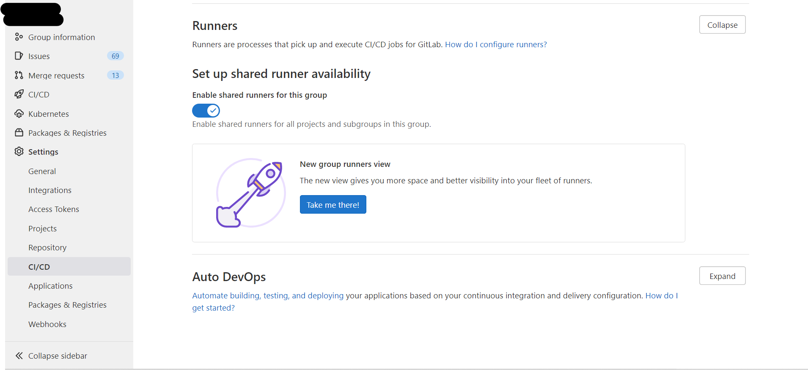
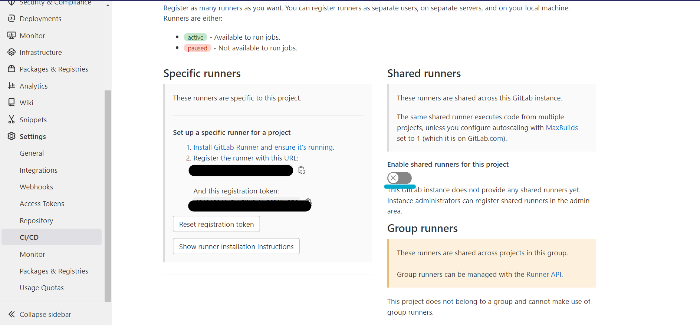
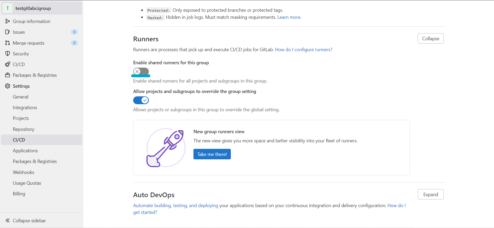
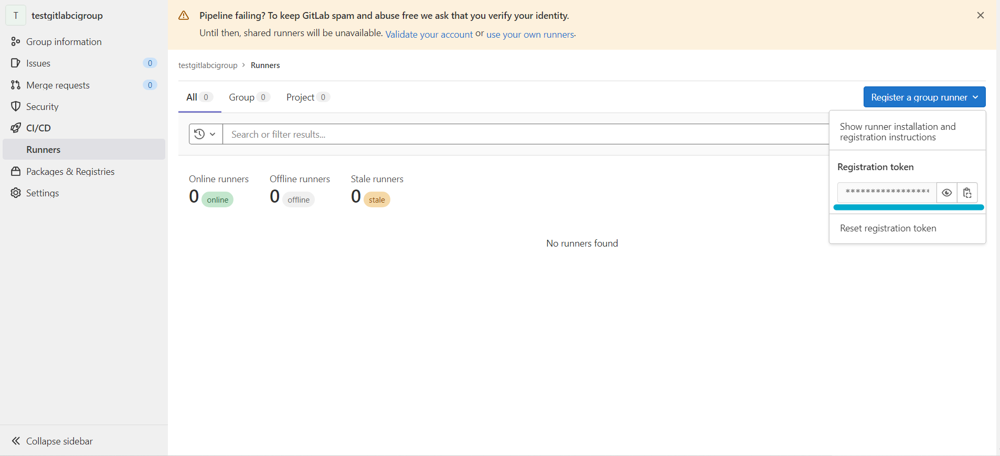
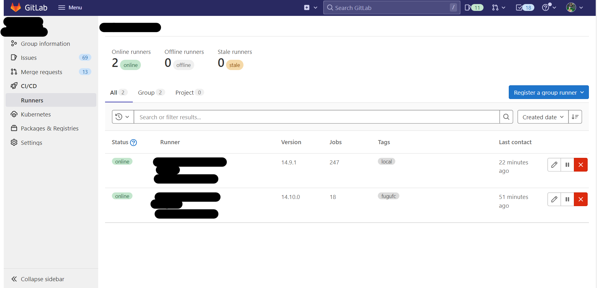
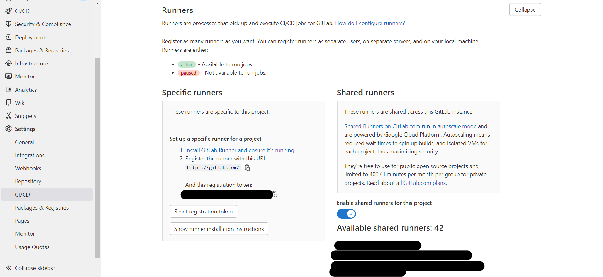
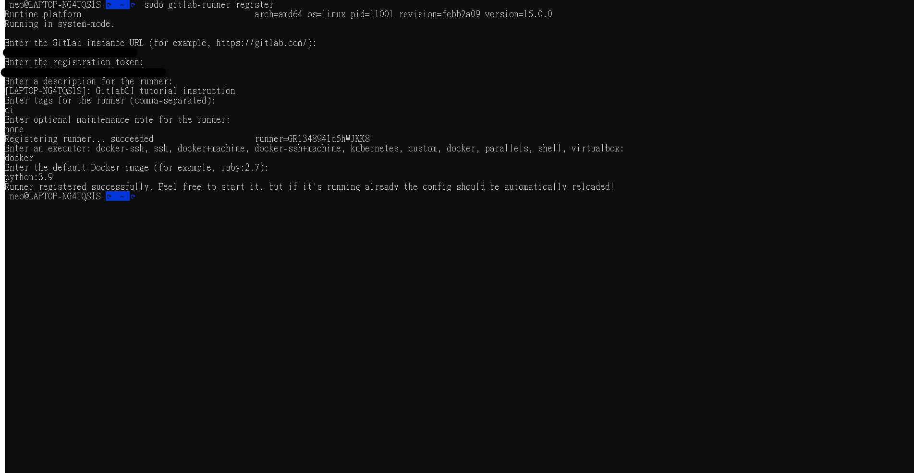

Runners
=======

scope
-----

  .. |scope| raw:: html

     

Gitlab CI/CD 的 runners 主要有三種分別是 ``Shared runners`` , ``Group runners``, ``Specific runners``

- Shared runners 適用於 Gitlab 裡面全部的 groups, projects
- Group runners 適用於 Gitlab 裡面全部的 projects 以及 group 底下的 subgroup
- Specific runners 適用於 Gitlab 裡面特定的 project, 一般來說是針對單一個 project。

**Shared runners**
******************

Shared runners 主要用於如果今天有多個專案所執行的 jobs 是雷同，以及相似的需求，就可以使用 Shared runners 去做 CI/CD 的任務執行，與其使用多個 runner 空閒在多個專案之間，使用這樣的方式去做執行也是不錯的選擇。

- 如果使用 Gitlab 自架服務

  * 管理者可以到 Project 的 `Settings` -> `CI/CD` -> `Runners` 安裝以及註冊 shared runners，點擊 ``Show runner installation instructions`` 可以看到相關系統安裝指令。

  .. image:: _static/share_runner_1.png

  .. rst-class:: image-source

  Photo by `fuguFish Creation Gitlab Account`

  .. image:: _static/share_runner_2.png

  .. rst-class:: image-source

  Photo by `Neo Change Gitlab Account`

  * 管理者也可以知道針對於每一個 group 的 `shared runners CI/CD 的上限時間 <https://docs.gitlab.com/ee/ci/pipelines/cicd_minutes.html#set-the-quota-of-cicd-minutes-for-a-specific-namespace>`_

- 如果使用 Gitlab.com 服務

  * You can select from a list of shared runners that GitLab maintains.

  * The shared runners consume the CI/CD minutes included with your account.

**Enable for a project**
########################

如果使用 Gitlab.com 服務的話 shared runners 在所有的 projects 預設都是 enabled

如果使用 Gitlab 自架服務，管理者可以自行決定對於所有的 projects 是否要 enabled shared runners

- 可以到以下範例圖片查看設定

  .. image:: _static/share_runner_for_project_1.png

  .. rst-class:: image-source

  Photo by `fuguFish Creation Gitlab Account`

  .. image:: _static/share_runner_for_project_2.png

  .. rst-class:: image-source

  Photo by `Neo Change Gitlab Account`

- 如果針對 project 做 enabled 的話，到 `Settings` -> `CI/CD` -> `Runners`，選擇 ``Enable shared runners for this project``

  .. image:: _static/share_runner_for_project_3.png

  .. rst-class:: image-source

  Photo by `fuguFish Creation Gitlab Account`

**Enable for a group**
######################

- 到 group 的 `Settings` -> `CI/CD` -> `Runners`，選擇 ``Enable shared runners``

.. rst-class:: image-source

Photo by `fuguFish Creation Gitlab Group`

**Disable for a project**
#########################

-  到 project 的 `Settings` -> `CI/CD` -> `Runners`，選擇 ``Enable shared runners for this project``

.. rst-class:: image-source

Photo by `fuguFish Creation Gitlab Project`

**Disable for a group**
#######################

- 到 group 的 `Settings` -> `CI/CD` -> `Runners`，選擇 ``Enable shared runners``

.. rst-class:: image-source

Photo by `Neo Change Gitlab Account`

**Group runners**
*****************

**Create a group runner**
#########################

1. `安裝 Gitlab Runner <https://docs.gitlab.com/runner/install/linux-manually.html>`_
2. 選擇要執行的 group
3. Sidebar 點選 `CI/CD` -> `Runners`
4. 記住 URL 以及 token，如果是使用 Gitlab.com 的服務 URL 會是 ``https://gitlab.com/``，自架服務則是看設定的 Domain

.. Tip::
  # 官方說明
  When registering a runner on GitLab.com, the gitlab-ci coordinator URL is https://gitlab.com.

.. rst-class:: image-source

Photo by `Neo Change Gitlab Account`

5. `註冊 runner <https://docs.gitlab.com/runner/register/>`_

**View and manage**
###################

1. 選擇要查看的 group
2. Sidebar 點選 `CI/CD` -> `Runners`

.. rst-class:: image-source

Photo by `fuguFish Creation Gitlab Group`

**Specific runners**
********************

**Create a specific runner**
############################

1. `安裝 Gitlab Runner <https://docs.gitlab.com/runner/install/linux-manually.html>`_
2. 選擇要執行的 project
3. Sidebar 點選 `Settings` -> `CI/CD` -> `Runners`
4. 記住 URL 以及 token，如果是使用 Gitlab.com 的服務 URL 會是 ``https://gitlab.com/``，自架服務則是看設定的 Domain

.. Tip::
  # 官方說明
  When registering a runner on GitLab.com, the gitlab-ci coordinator URL is https://gitlab.com.

.. rst-class:: image-source

Photo by `Neo Change Gitlab Account`

5. `註冊 runner <https://docs.gitlab.com/runner/register/>`_

register a runner
-----------------

你可以藉由 register 指令使 runner 在同一個主機上重複註冊多次，並根據每一個 runner 有不同的 configuration

**Linux**
*********

1. 安裝 gitlab-runner，使用 Official Linux Package 或是其他方式安裝， `參考連結 <https://docs.gitlab.com/runner/install/linux-manually.html/>`_

  .. code-block:: console

    curl -L "https://packages.gitlab.com/install/repositories/runner/gitlab-runner/script.deb.sh" | sudo bash

- 執行完會告知可以安裝 package，並執行以下指令 :

  .. code-block:: console

    sudo apt-get install gitlab-runner

.. note::

   如果執行 apt-get install gitlab-runner 出現 `No such file or directory`，嘗試使用以下指令

    .. code-block:: console

      # 建立 dpkg 資料夾
      sudo mkdir -p /var/lib/dpkg/{alternatives,info,parts,triggers,updates}

      # 建立檔案
      sudo touch /var/lib/dpkg/status

      # 安裝 dpkg package
      sudo apt install dpkg

      # 安裝 gitlab-runner package
      sudo apt-get install gitlab-runner

2. 執行以下指令 :

  .. code-block:: console

    sudo gitlab-runner register

如果是 proxy 的話，新增環境變數，再執行指令

  .. code-block:: console

    export HTTP_PROXY=http://yourproxyurl:3128
    export HTTPS_PROXY=http://yourproxyurl:3128

    sudo -E gitlab-runner register

3. 輸入 Gitlab URL，如果不是自架服務就是 Gitlab 預設的 gitlab-ci coordinator URL，如果是自架服務一般來說是你的 Domain，或是可以到 Project 的 `CI/CD` -> `Runners` 裡面查看
4. 輸入 `CI/CD` -> `Runners` 裡面的 token
5. 輸入 runner 的相關訊息，後續可以透過 user interface 改變內容
6. 輸入 runner 的 tags，如果有多個用逗號分開，這個也可以透過 user interface 改變內容
7. 輸入 runner maintenance note (Optional)
8. 輸入 runner 的執行模式，一般來說都是使用 docker，如果專案並沒有要使用容器技術的話，可以選擇 shell

.. note::

  如果 runner executor 選擇 docker 的話，會被詢問 default 的 image

範例：

.. rst-class:: image-source

Photo by `Neo Change Gitlab Account`

.. Tip::
  如果想要查看剛剛操作的 configuration 可以到以下路徑確認

  .. code-block:: console

    /etc/gitlab-runner/config.toml

runner executors
----------------

**Docker**
**********

**Workflow**
############

Docker executor 執行 job 的步驟

1. 準備：新增與開始 services
2. 前置工作：複製與回復 cache, 從前一個 stages 下載 artifacts，run on special docker image
3. 工作：建置，run on developer provided docker image
4. 後置工作： 新增 cache, 上傳 artifacts 到 Gitlab，run on special docker image

.. Tip::
  special docker image 主要是 Alpine version 的 image 包含所有 prepare, pre-job, post-job 步驟所需要的 tools

**The image keyword**
#####################

The image keyword 就是在你 local 端所擁有的 images 名稱或是在 Docker Hub 上可以被找到的任何 image 名稱，如果沒有指定 image 的 namespace，Docker 預設包含所有官方的 images latest version，所選擇的 image 必須的 os PATH 包含 working shell, Linux 的話像是 sh, bash, pwsh (since 13.9), Windows 的話是 PowerShell

**The services keyword**
########################

The services keyword 就是另一個 docker image，在建立 image keyword 定義的 image 的期間中執行，它允許在 image keyword build 的途中去 access service image，service image 可以在任何的 application 上運作，主要普遍使用的會使 database 的 image，Ex: mysql，而使用已經既有存在的 image 當作額外的容器附加執行於提供的 docker image 比每一個專案建置的時候安裝還來的更簡單與快速，如果需要，可以給每一個服務一個自己的暱稱

**image and services keyword from .gitlab-ci.yml**
##################################################

你可以簡單的定義一個 image 適用於所有的 jobs，列出那些所需要的 services

.. code-block:: yaml

  image: 'python:3.9'

  services:
    - postgres:13-alpine

  stages:
    - build

  build:
    stage: build
    tags:
      - 'ci'
    variables:
      description: "This is key description's value"
    script:
      - echo "This job for testing manually run pipeline functionality"
      - echo "$description"

也可以針對每一個 job 給不同的 images 以及 services

.. code-block:: yaml

  before_script:
    - bundle install

  test:3.9:
    image: python:3.9-slim
    services:
    - postgres:13-alpine
    script:
    - bundle exec rake spec

  test:3.10:
    image: python:3.10-slim
    services:
    - postgres:14-alpine
    script:
    - bundle exec rake spec

**Define image and services in config.toml**
############################################

.. code-block:: toml

  [runners.docker]
  image = "python:3.9-slim"

  [[runners.docker.services]]
    name = "postgres:13-alpine"
    alias = "db"

  [[runners.docker.services]]
    name = "redis:latest"
    alias = "cache"

.. note::

  如果是透過 config.toml 來做 images 跟 services 的設定的話，runners 在執行的時候會套用在所有的 builds，即便沒有定義 image 在 .gitlab-ci.yml 檔案也沒關係，會透過 config.toml 裡面所設定的使用

Reference
---------

  - https://askubuntu.com/questions/1141719/could-not-open-lock-file-var-lib-dpkg-lock-frontend-open-2-no-such-file-or
  - https://superuser.com/questions/1216965/sudo-apt-get-error-flabspath-on-var-lib-dpkg-status-failed-no-such-file-or-d
