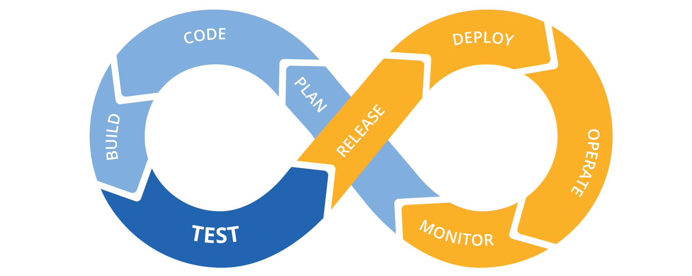
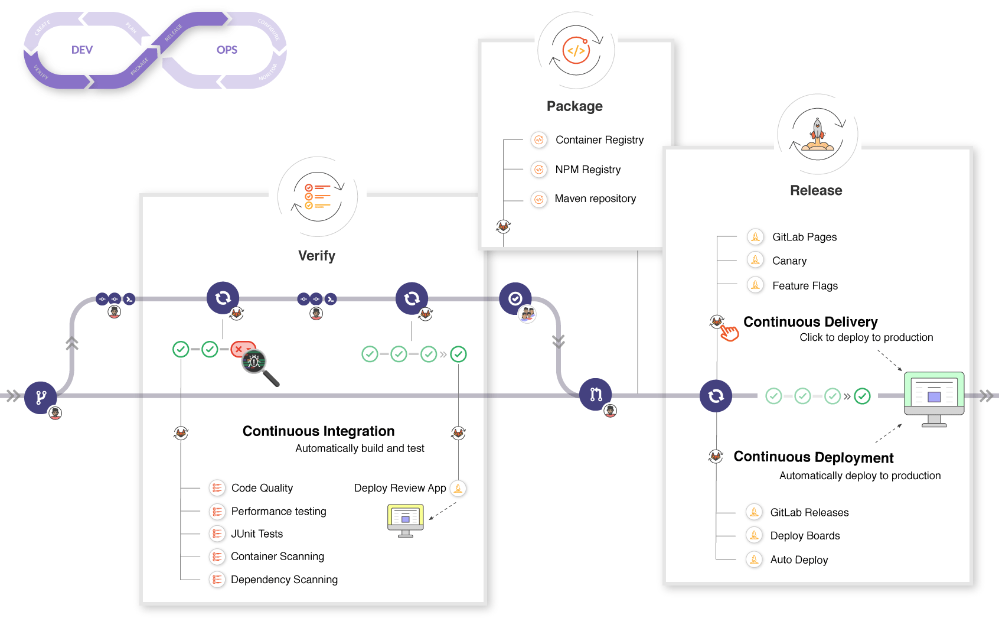

What is CI/CD ?
===============

.. epigraph::

  Automate your software development workflows and deploy better quality code, more often. Using a continuous and iterative process to build, test, and deploy helps avoid bugs and code failures.

  -- Gitlab

從語意來看基本上就是說，將過去軟體開發的流程與部屬從人為操作變成自動化，這樣的轉變會使開發流程更頻繁，並藉由 CI/CD 自動化連續性的特性去執行程式碼建立、測試、部署，有效地避免 bugs 與程式碼失敗。

CI Definition
-------------
  .. |CI| raw:: html

     

Continuous integration （持續整合），開發者在每一天的程式碼改動是非常頻繁地，而就是因為頻繁性改動的關係，導致有時候會出現人為錯誤，這也就是為什麼會有 unittest （單元測試）的出現，驗證程式碼在模擬環境的情況下是否會出現遺漏之處，抑或是特別例外。將這些 unittest 整合在一起 （包含 Database、UI/UX）便是所謂的 Integration test，最後將這些更動的程式做自動化流程的驗證，去執行完整性的測試，確保在產品正式上線後不會發生重大性的問題。

CD Definition
-------------
  .. |CD| raw:: html

     

CD 主要分別兩個部分為 ``Continuous Delivery``, ``Continuous Deployment``，，兩者皆在 Continuous integration 之後執行相關的動作，那這兩者又有什麼差別的？

Continuous Delivery（持續交付），當每次程式碼改動與推送 remote repository 的過程中不僅是對程式碼做建立與測試，而且也會做自動化的驗證與持續部署，然而當流程完畢後會需要人為的介入，手動觸發後續部署的動作。

Continuous Deployment（持續部署），主要的意思跟 Continuous Delivery 大同小異，主要差別在於自動化地執行部署的動作，不需要人為的介入。

DevOps Cycle workflow
---------------------
  .. |DevOps workflow| raw:: html

     

.. rst-class:: image-source

Photo by `Kenny's Blog <https://blog.kennycoder.io/2020/04/07/CI-CD-%E6%8C%81%E7%BA%8C%E6%80%A7%E6%95%B4%E5%90%88-%E9%83%A8%E7%BD%B2-%E5%9B%A0%E7%82%BA%E6%87%B6%EF%BC%8C%E6%89%80%E4%BB%A5%E6%9B%B4%E8%A6%81CI-CD%EF%BC%81%E6%A6%82%E5%BF%B5%E8%AC%9B%E8%A7%A3%EF%BC%81/cover.png>`_

- PLAN
   * 提出欲建構的功能，並與團隊協作、溝通討論來製作功能相對應的規格。

   * 最後，透過這些回饋去建構相對應的功能，解決 bugs，生產出新版本的架構，並持續這個循環。

- CODE
   * 開發者實作出符合規格上的功能應用，使相對應的功能能夠版本釋出。

- BUILD
   * 在每一次 Commit & Push，建立一致的模擬環境，確保推送到 remote repository 的程式碼不會因為環境或是其他相關問題導致編譯失敗或是服務異常。

- TEST
   * 驗證更動後程式碼是否有問題，以及是否影響既有功能，而主要會有兩種測試，分別為自動（automatic）與手動（manual），自動通常是指 CI，而手動則是 QA（quality assurance）.

- RELEASE
   * 透過持續部署的策略，自動化地將更動的內容執行發佈的動作。

- DEPLOY
   * 將欲發佈的版本內容佈署到雲端伺服器上，而這也意味著所有人都能夠訪問你的網站。

- OPERATE
   * 監控應用程式並根據需求自動擴展容量，確保有足夠資源能負載既有流量，盡可能以最低成本維持穩定、可預測的效能。

- MONITOR
   * 監控應用程式執行上是否有錯誤內容（包含瀏覽、新建、更新等相關請求操作）、以及使用者體驗是否良好。

GitlabCI workflow
-----------------
  .. |GitlabCI workflow| raw:: html

     

Gitlab CI/CD 所設計的 Pipeline 適用於目前普遍 CI/CD 的開發流程，你可以透過 Gitlab issue 開始討論程式碼新增、改動，並在 local 端做開發，當你 push Commit 到 remote repository，就會去觸發專案的 CI/CD Pipeline。

- 執行自動化腳本（順序或是並行）

  * 建立以及測試你的應用程式

  * 透過 `Review APP <https://docs.gitlab.com/ee/ci/review_apps/>`_ 預覽更動的內容，如同在 local 端測試顯示的內容

  .. note::

    Review APP 功能需要設定好 Kubernetes 以及網域、因本人執行過之專案皆尚未使用 Kubernetes 故這邊不多加說明，有興趣可以點選 Review APP 連結

  * Code Reviewed and Approved Merge Request to default branch

.. note::
  如果發生錯誤，可以 rollback 你的更動。

.. rst-class:: image-source

Photo by `Gitlab <https://docs.gitlab.com/ee/ci/introduction/img/gitlab_workflow_example_11_9.png>`_

Reference
---------

  - https://about.gitlab.com/topics/ci-cd/
  - https://docs.gitlab.com/ee/ci/introduction/
  - https://blog.kennycoder.io
